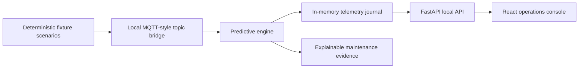

# PredictaLine — Local IoT Predictive-Maintenance Platform

PredictaLine is an **local-only IoT predictive-maintenance demonstration**. It turns deterministic synthetic equipment telemetry into explainable maintenance priorities through a FastAPI backend and a React operations console. It is intentionally scoped as a safe portfolio artifact: it accepts only in-process fixture data, has no hardware connectors, and does not initiate external network activity.

> **Demonstration boundary:** PredictaLine is not a production safety system and must not be used to operate, control, or make autonomous maintenance decisions for real equipment.

| Capability | Implementation | Interview signal |
| --- | --- | --- |
| Deterministic telemetry | Four scenario fixtures replay local sensor events on demand | Reproducible demonstrations and testable data contracts |
| Predictive scoring | Isolation Forest anomaly signal plus transparent trend-based evidence | Practical machine-learning integration with explainability |
| Stream safety | A constrained, MQTT-style local topic bridge only accepts approved demo topics | Defensive input handling and safe integration boundaries |
| Operations console | React dashboard presents fleet readiness, asset priority, sensor metrics, and evidence | Product thinking and readable operational UX |
| Quality gates | Pytest, Ruff, Vitest, TypeScript, Vite build, and GitHub Actions | Engineering discipline and delivery readiness |

## Architecture



The platform remains local by design. Replay data lives in the repository, model training uses the local fixtures, and the in-memory journal resets between scenarios. No cloud account, physical device, production database, paid service, or continuously running service is required.

## Demonstration scenarios

| Scenario | Expected maintenance posture | Demonstration value |
| --- | --- | --- |
| `steady_state` | Routine | Shows a healthy baseline and no maintenance cue |
| `thermal_drift` | Watch or plan | Shows an elevated temperature trend requiring review |
| `bearing_wear` | Urgent review | Shows high vibration evidence and an explainable urgent cue |
| `pressure_instability` | Watch or plan | Shows fluctuating pressure requiring inspection planning |

The verified `bearing_wear` replay presents an **88/100 urgent-review** posture, while the reviewed `steady_state` replay returns **0/100 routine** status. The exact output is deterministic and can be reproduced with the local API or dashboard.

## Quick start

The project requires Python 3.12+, Node.js 22+, and the `npx` command. Use two terminals after the initial bootstrap.

```bash
git clone <your-private-repository-url>
cd predictaline-iot-maintenance-platform
make bootstrap
```

Start the API in the first terminal:

```bash
make api
```

Start the dashboard in the second terminal:

```bash
make web
```

Then open `http://localhost:5203`, select a scenario, and replay it. The default local API is available at `http://127.0.0.1:4901`; interactive API documentation is at `http://127.0.0.1:4901/docs`.

## Docker Compose

Docker Compose packages the API and dashboard separately while keeping the API internal container port at `8000`. The browser-facing dashboard uses the same safe, local API mapping.

```bash
cp .env.example .env
docker compose up --build
```

Open `http://localhost:5203` after the API health check passes. Stop the local stack with `make compose-down`.

## Quality gates

Run the full local quality gate before presenting or publishing a change:

```bash
make lint
make test
make build
```

GitHub Actions repeats the equivalent checks in separate API and web jobs. The API job runs Ruff and Pytest; the web job installs from the locked pnpm dependency graph, runs Vitest, type-checks, and creates a production Vite build.

## API surface

| Endpoint | Purpose |
| --- | --- |
| `GET /health` | Confirms local deterministic-demo mode |
| `GET /api/scenarios` | Lists the available fixture scenarios |
| `POST /api/replay/{scenario}` | Resets the journal and replays a selected scenario |
| `GET /api/fleet` | Returns fleet-level readiness and asset snapshots |
| `GET /api/assets/{asset_id}` | Returns an individual asset’s telemetry and advisory |
| `GET /api/metrics` | Returns local replay and advisory counts |
| `GET /metrics` | Exposes a small Prometheus-compatible text metric view |

## Safe-use constraints and project documentation

The project deliberately does **not** connect to brokers, shop-floor networks, external devices, customer systems, or third-party cloud services. It has no autonomous actuation capability and treats all maintenance output as an explainable demonstration prompt for qualified human review. See the supporting project documentation for technical details:

| Document | Description |
| --- | --- |
| [Architecture](docs/ARCHITECTURE.md) | Local operating model, telemetry contract, and scoring flow |
| [Scenario catalog](docs/SCENARIO_CATALOG.md) | Fixture details and expected scenario behavior |
| [Safe-use guide](docs/SAFE_USE.md) | Explicit operational boundaries and prohibited uses |
| [Research notes](docs/RESEARCH_NOTES.md) | Background references for the technology choices |
| [Demo verification](docs/DEMO-VERIFICATION.md) | Recorded local dashboard verification outcomes |


